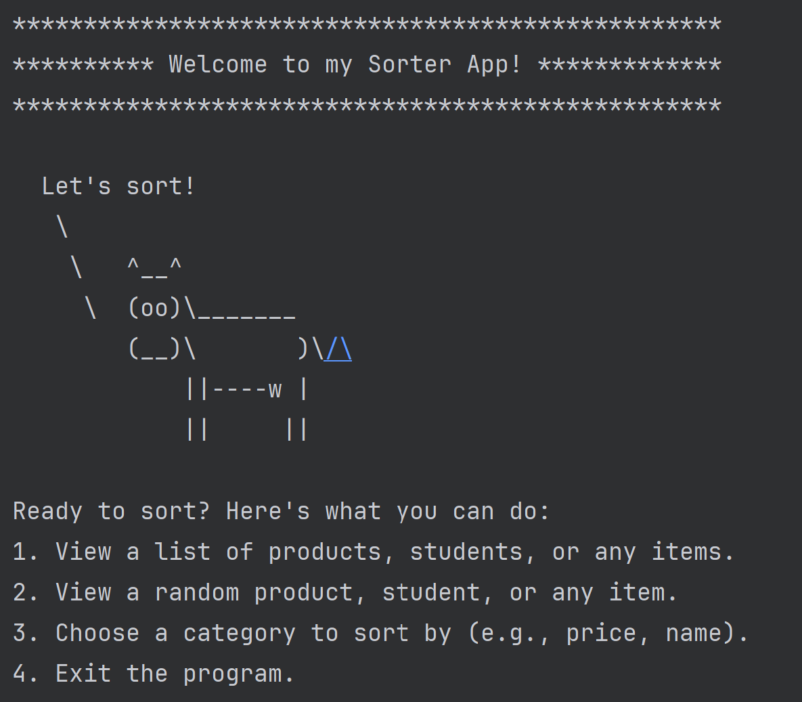
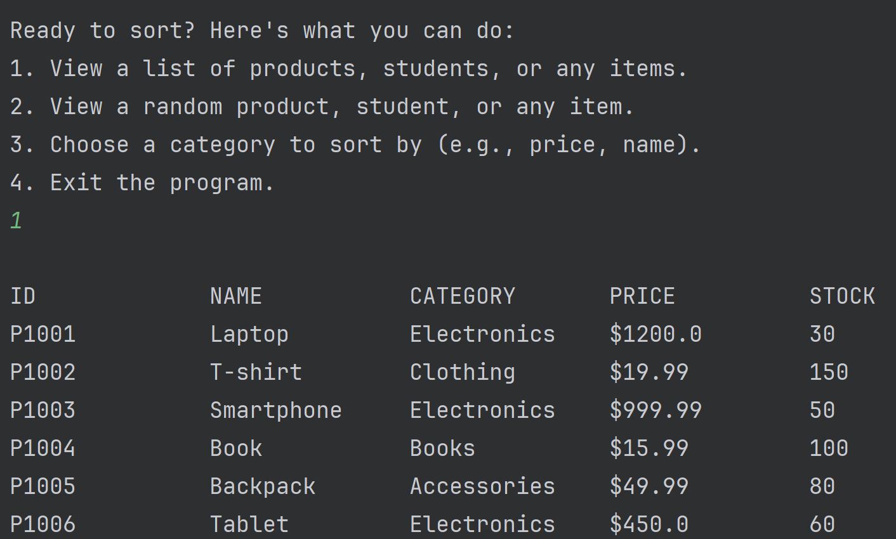
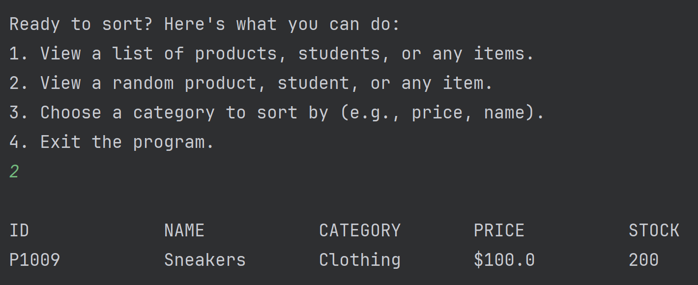
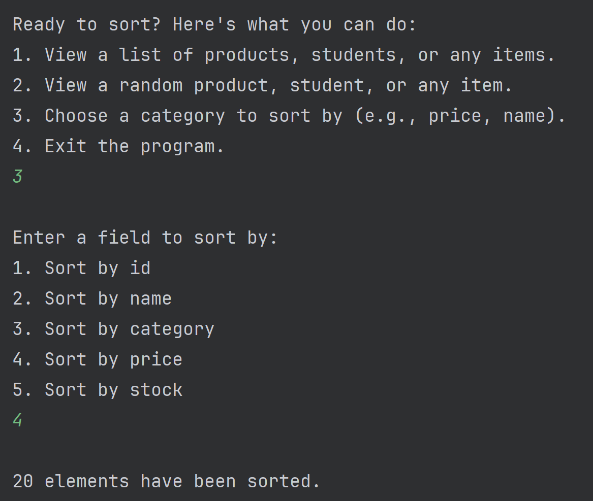
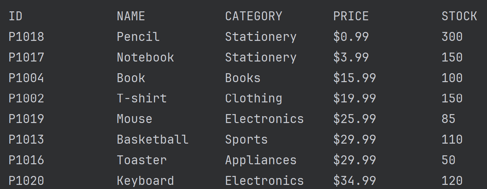
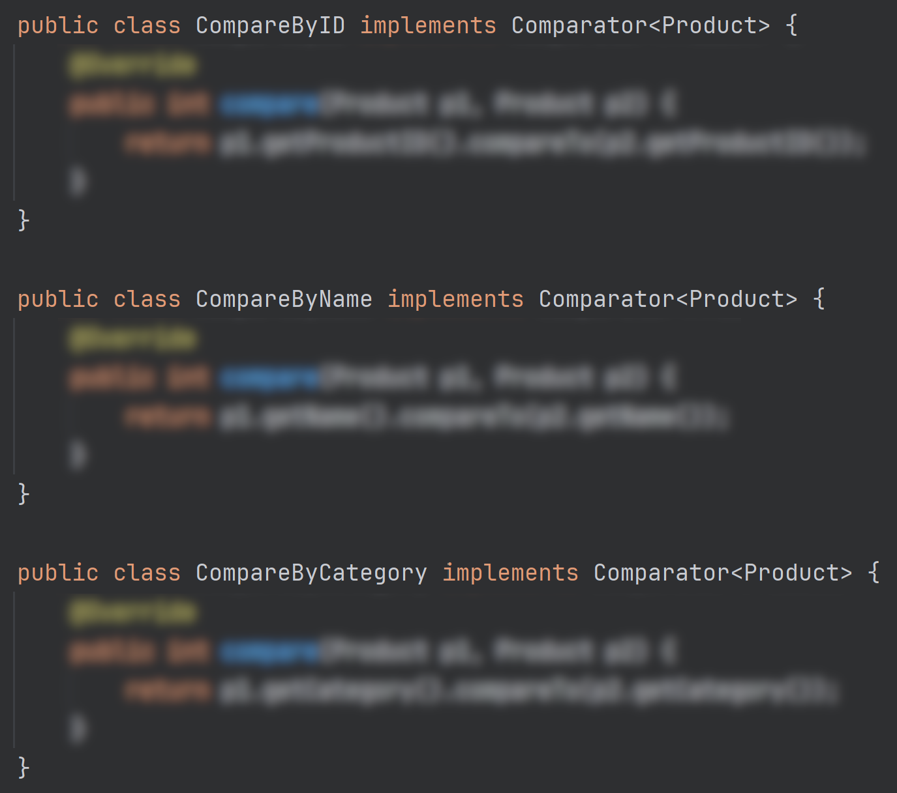

# Individual Assignment: Sorting Application

## Overview
In this project, you'll explore sorting algorithms by developing a Java application 
that sorts user-defined model objects. Instead of using a predefined dataset, you'll 
design a model object with at least five sortable fields, then generate your own 
dataset using generative AI like ChatGPT to test the sorting functionality.

## Objectives
- Design a model object with at least five attributes that can be ordered.
- Use generative AI to create a CSV file with at least 20 records based on your model.
- Implement the heap sort algorithm in Java to sort these objects.

## Designing Your Model Object
Start by defining a model class in Java with at least five attributes. Each attribute 
should be capable of being ordered (e.g., numerical values, strings, dates). This 
structure will form the basis for your sorting application.

## Generating Test Data with ChatGPT
Next you should use generative AI, such as ChatGPT, to create a dataset for testing:
- Sign up for a free ChatGPT account <a href="https://chat.openai.com/">here</a>.
- Once registered, use ChatGPT to generate realistic data that fits the structure 
  of your model object. Ask it to produce a CSV formatted output with at least 
  **20** unique records.
- Save this data as a CSV file to be used in your application.

Note: The examples below are for illustrative purposes only (a Product class). Your model class should   
be unique and tailored to your interests.

## Console Interface
Develop a console application that welcomes users and presents options for displaying and sorting the dataset. Users
should first be presented with this message:



You use the following code segment to draw the cow - 
<a href="https://gist.github.com/joshbarcher/61da3f944ed8c9f12e1b72d810a2f807">gist</a>. 

If a user chooses option #1, the application should display the dataset in a tabular format. The order
of elements should match the order these were read from the CSV file.



If a user chooses option #2, the application should display a random record.



If a user chooses option #3, the application should display a menu of sorting options. The user can select
an attribute to sort the dataset by. The application should then display the sorted dataset in a tabular format.



Afterward, the application should display the main menu again. Then the user should be able to verify the
sort by using option #1.



## Flexible Sorting with Comparators
To allow for sorting by different fields, we will be focusing on the 
<a href="https://docs.oracle.com/en%2Fjava%2Fjavase%2F21%2Fdocs%2Fapi%2F%2F/java.base/java/util/Comparator.html">Comparator</a> 
interface for this assignment and not the Comparable interface. The Comparator interface allows for more flexibility in 
sorting, as it allows for multiple sorting criteria. You will need to define a new Comparator class for each attribute 
of your model object.

For example:



Note: The semantics of the Comparator interface are the same as Comparable. The only difference is that you
are using a third party class to make the comparison and the comparison logic is not part of the model object.
Both elements being compared are passed as arguments to the compare() method.

## Using Arrays.sort()
Once you have written the Comparators and your console interface, you can use the Arrays.sort() method to sort
your dataset. The Arrays.sort() method takes an array of objects and a Comparator as arguments. It will sort the
array in place.

```java
Arrays.sort(data, new Comparator<YourModelObject>();
```

Note: You will need to convert your CSV data into an array of objects before sorting. You can use the Scanner
class to read the CSV file and create an array of objects. You can then use the Arrays.sort() method to sort the
array. 
Note: Some boilerplate code for this step has been provided in the ModelIO class.

## Using Heap Sort
Lastly, we are trying to not just learn how to use sorting algorithms, but how to write one as well.
For example, the Arrays.sort() method has used the following algorithms internally:
- Dual-Pivot Quicksort for primitive arrays (read more <a href="https://en.wikipedia.org/wiki/Quicksort#Multi-pivot_quicksort">here</a>)
- Tim Sort (a variation of merge sort) for object arrays (read more <a href="https://en.wikipedia.org/wiki/Timsort">here</a>)

For this assignment, you will be implementing the Heap Sort algorithm, as described in class. 
You have already been provided with a HeapSorter class that has a sort() method. You will need to implement the
**build-heap** and **sort** steps as part of this class. The remaining code has already been provided to you.


Note: Try not to overthink this step. You are only being asked to write two loops in the sort() method. One
loop should repeatedly call the sink() method for the build-heap step. The other loop should repeatedly call the
remove() method for the sort step.

Note: We are implementing the in-place version of the heap sort algorithm. This means that the array is sorted
in place and no additional memory is used. If you are using additional memory (e.g. a second array, or list), 
you are not implementing the algorithm correctly.

Note: No recursive solutions for the heap sort algorithm are allowed. The algorithm should be implemented using
loops only.

When you are done, you can use the HeapSorter class to sort your dataset, rather than the Arrays.sort() method.
Verify that the application still works as expected.

## Plagiarism Reminder

Please remember that you are not allowed to copy code from the internet or from your classmates. You are allowed to
use the code provided in the assignment, but you are expected to write the rest of the code yourself. Your instructor
is aware of alternative solutions for heap sort available online (e.g. <a href="https://www.geeksforgeeks.org/heap-sort/">here</a>).
Any submission that is found to be copied will result in a grade of 0 for the assignment.

## Submitting your work


1. Verify that each of your classes and public methods has a Javadoc comment.
2. Verify that your assignment is passing a linter check using the IntelliJ inspector tool.
2. Ensure your code is correctly pushed to your GitHub classroom repository.